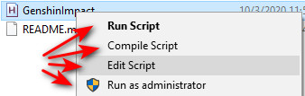

# GameHelper
Some Auto Hot Key Macro for some games

## How to Use

Method1: 直接运行[release](https://github.com/GreyRaphael/GameHelper/releases)中的可执行文件

Method2:
1. 下载[Auto Hot Key](https://www.autohotkey.com/)
2. 然后鼠标右键: 四种都可以试试
   >   
   - Run Script: 直接运行脚本
   - Compile Script: 将ahk脚本编译成Method1中的exe
   - Edit Script: 修改ahk脚本
   - Run as Administrator: 游戏需要管理员权限运行脚本